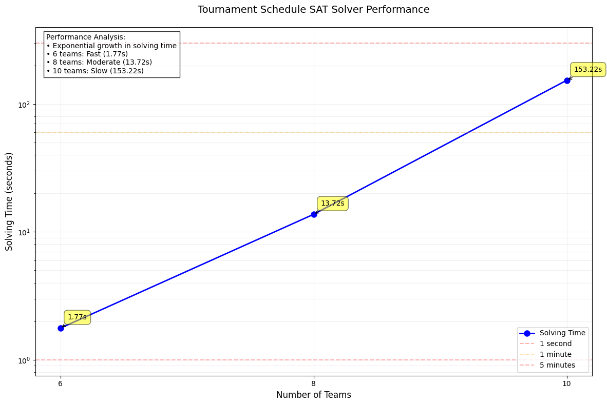

# Tournament Schedule SAT Solver

A Python SAT solver for optimal tournament schedules.

## Features

- Generates optimal tournament schedules for even number of teams
- Each team plays against every other team exactly once
- Maintains scheduling constraints:
  - One match per team per week
  - Maximum two matches per team in any period
  - One match per period per week
- Performance analysis for different team sizes

## Requirements

- Python 3.11+
- External Glucose SAT Solver

## Test Instances

1. n = 4  | Unsolvable
2. n = 6  | Easy example
3. n = 8  | Medium
4. n = 10 | Hard

## Usage

```python
from tournament_solver import TournamentScheduler, print_schedule

# Create a scheduler for 6 teams
scheduler = TournamentScheduler(6)

# Generate the schedule
schedule = scheduler.solve()

# Print the schedule
if schedule:
    print_schedule(schedule)
```

## Constraints

The solver implements the following constraints:

1. **One Match Per Pair**: Each team must play against every other team exactly once
2. **Weekly Limit**: Teams can only play one match per week
3. **Period Limit**: Teams can play up to two matches in the same period
4. **Period Scheduling**: Only one match can be scheduled per period per week
5. **Complete Weeks**: Each week must have at least one match

## Performance Analysis

The solver's performance has been analyzed for different team sizes:
- 4 teams: NOT SOLVABLE
- 6 teams: 1.77 seconds
- 8 teams: 13.72 seconds
- 10 teams: 153.22 seconds
- 12 teams: Solvable, just not on my machine.



The graph shows exponential growth in solving time as the number of teams increases. This is expected due to the NP-complete nature of the SAT problem.

## Limitations

- Only supports even number of teams
- Performance degrades exponentially with team size
- Practical limit around 6-10 teams

## File Structure

- `tournament_solver.py`: Main solver implementation
- `README.md`: Project documentation
- `glucose-syrup`: Required SAT solver

## Author

- Oleksandr Yatsenko
